# "Good" Lattice Constant Range-Finder

### The plots below show 
* First 3 derivatives of Energy vs alat
* First 3 orders of Local Energy Difference vs alat

<h3> HCNOS, ALLEGRO </h3>
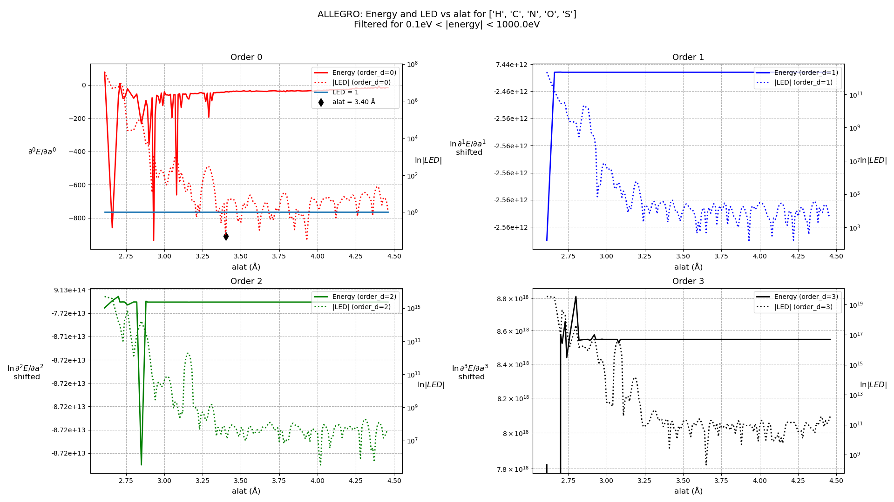
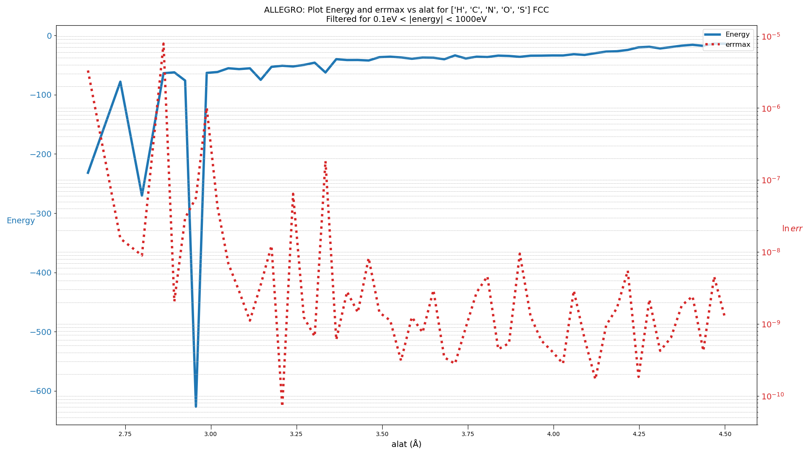

<h3> C , Allegro<h3>
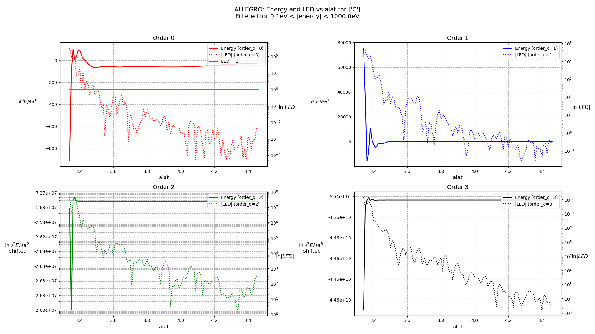

<h3> H , Allegro<h3>
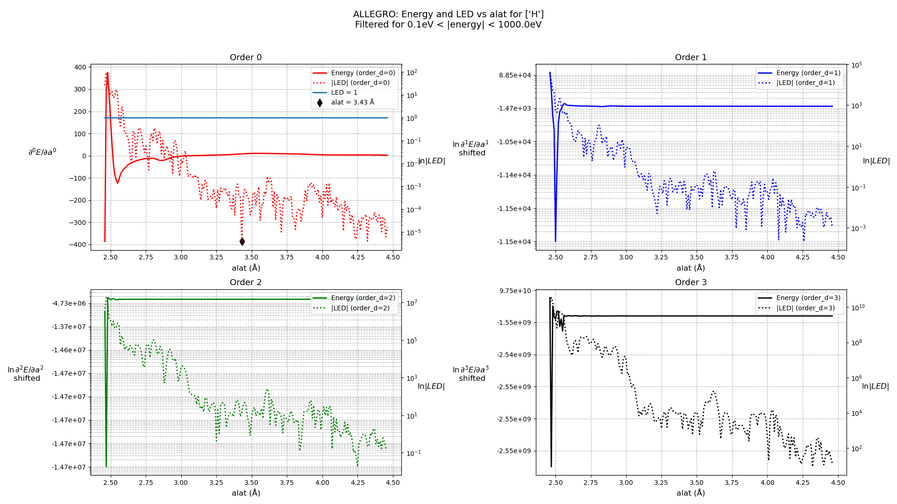
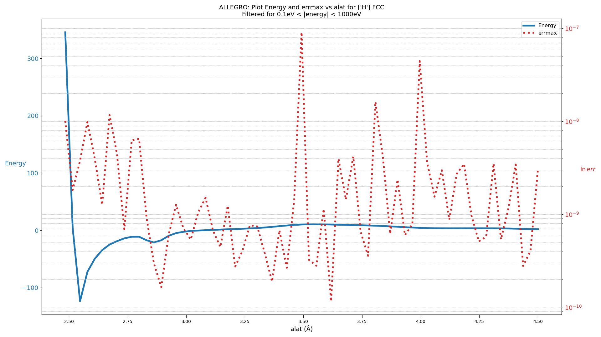

<h3> N , Allegro<h3>
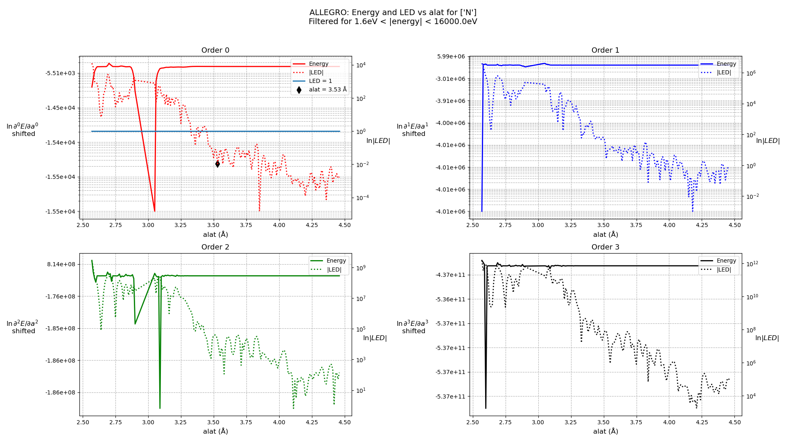

<h3> O , Allegro<h3>
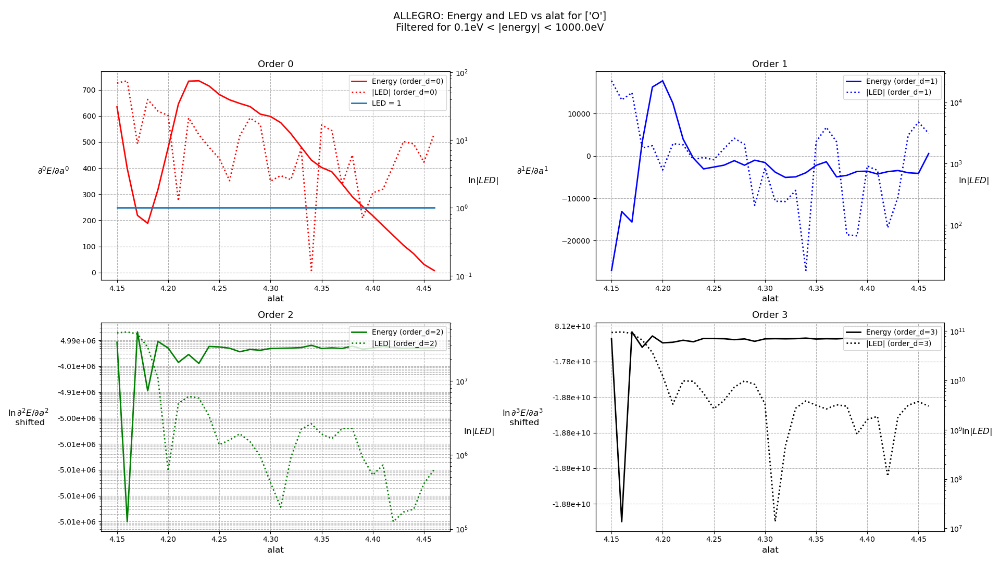

<h3> S , Allegro<h3>
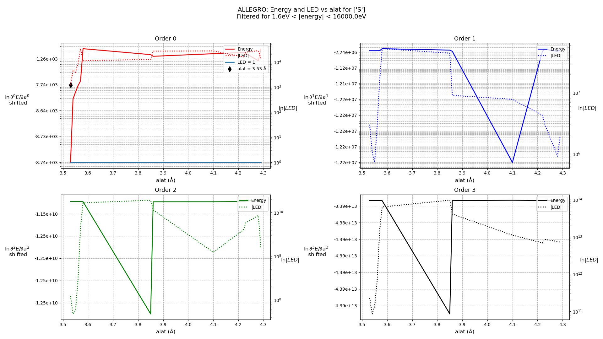

<h3> AlCoCrFeNi, MACE </h3>

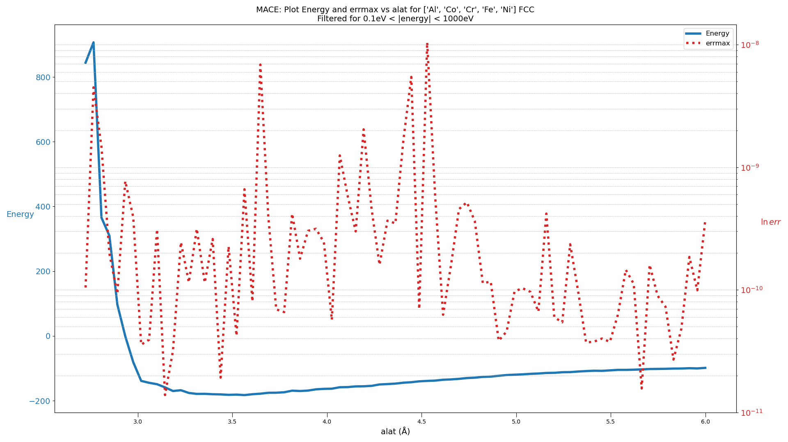

<h3> Al, EAMCubinNaturalSpline </h3>

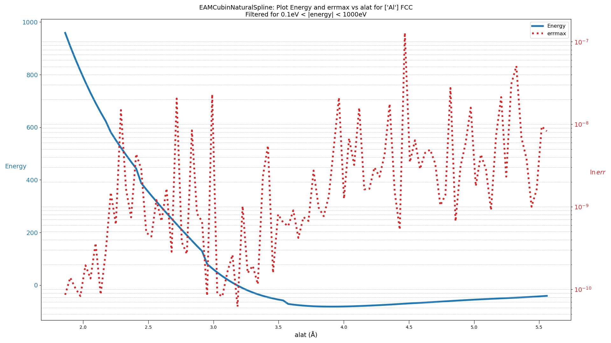

<h3> CdTe, SW_WangStroudMarkworth </h3>

<h3> CoCrFeNi, MACE </h3>
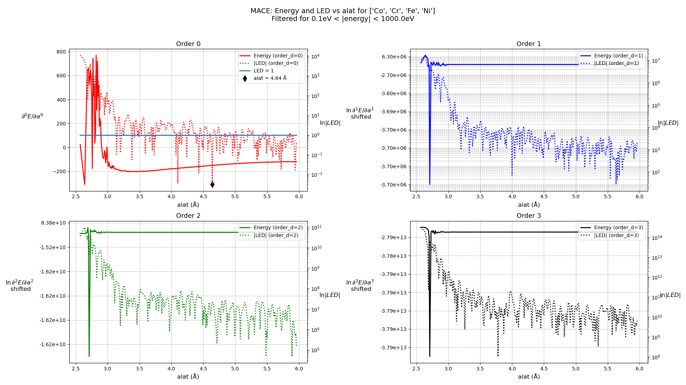
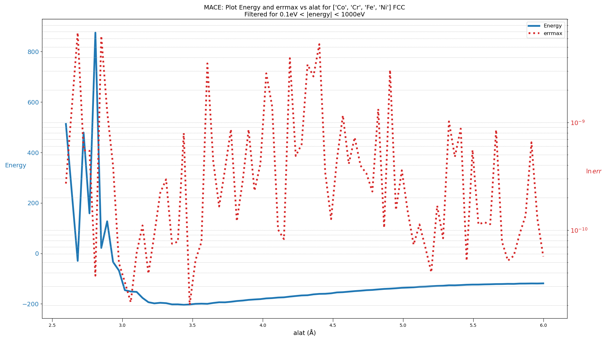

<h3> NiCoFeCrMn, MACE </h3>

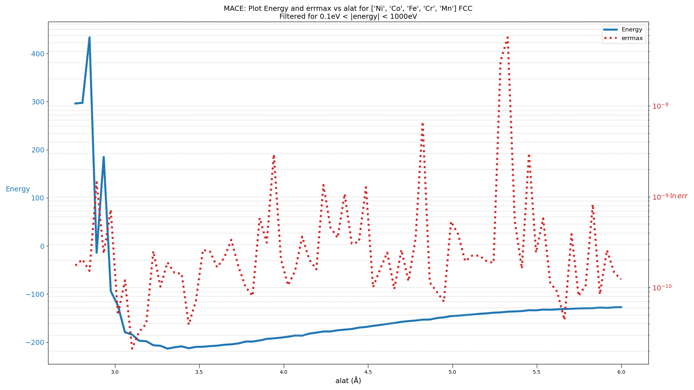

<h3> Si, MACE </h3>

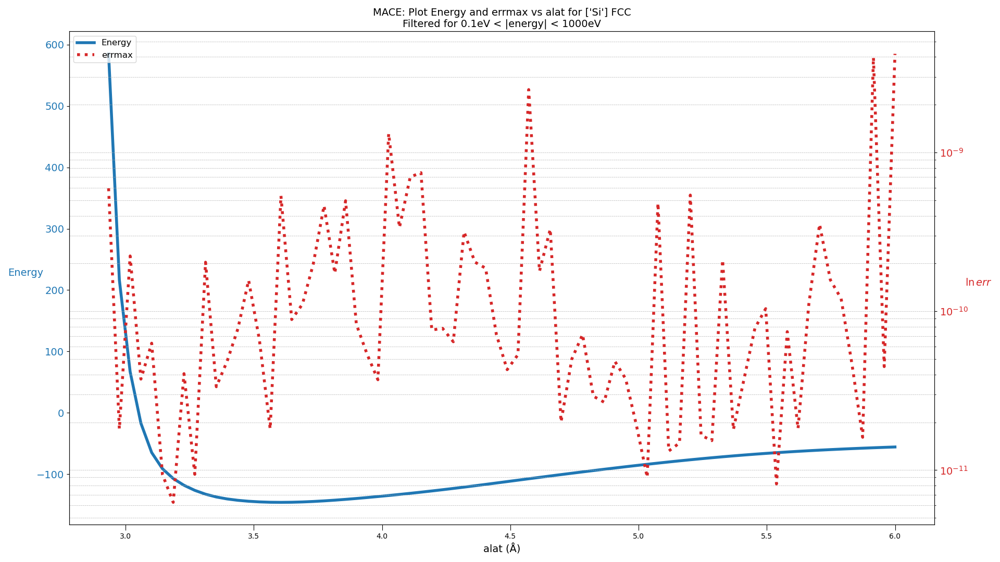

<h3> Si, StillingerWebber </h3>

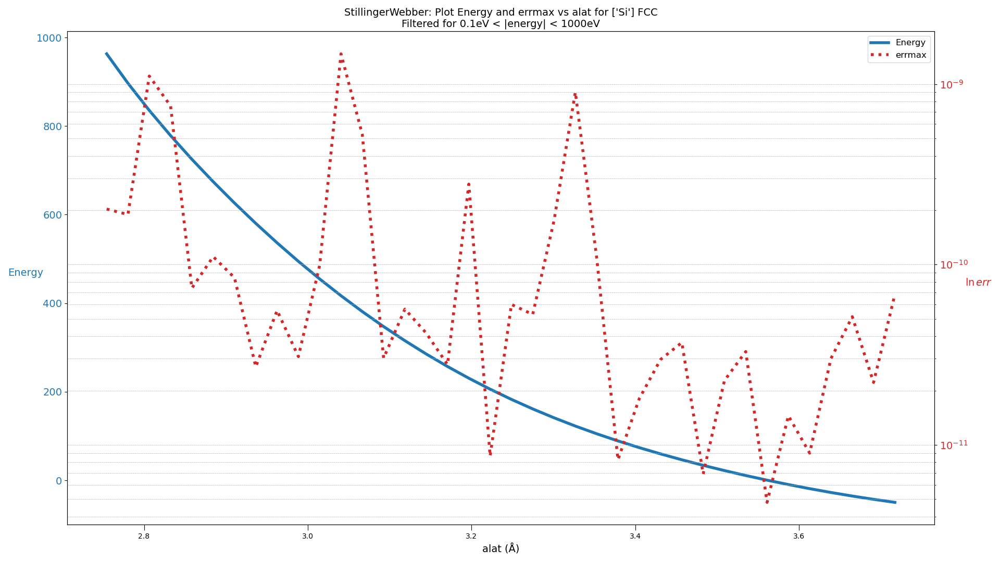

<h3> Si, SW_LeeHwang </h3>

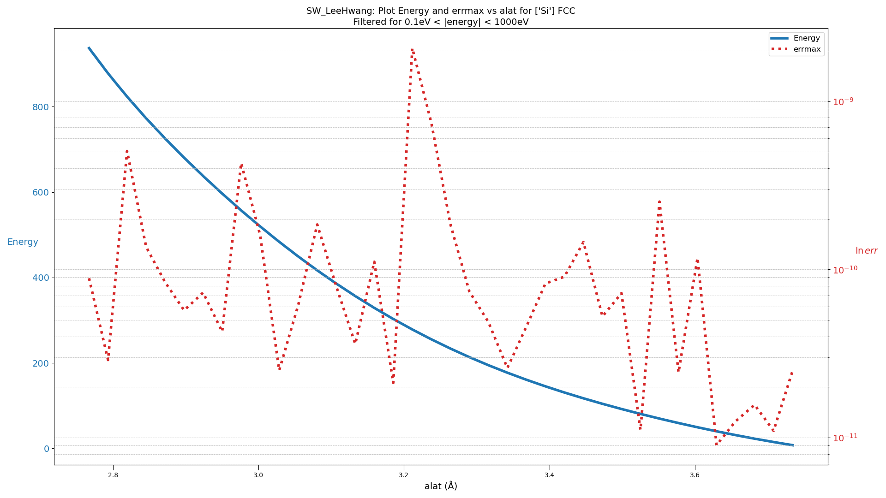

