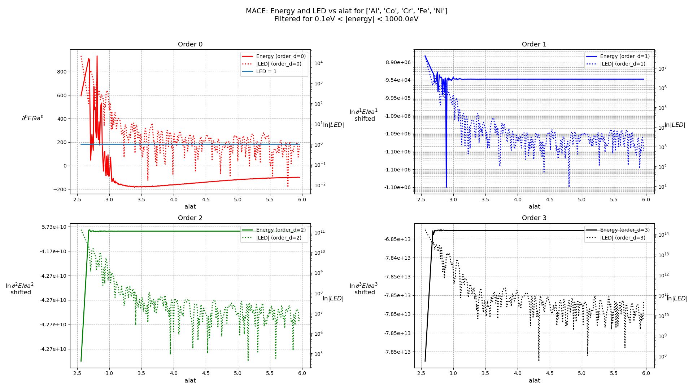
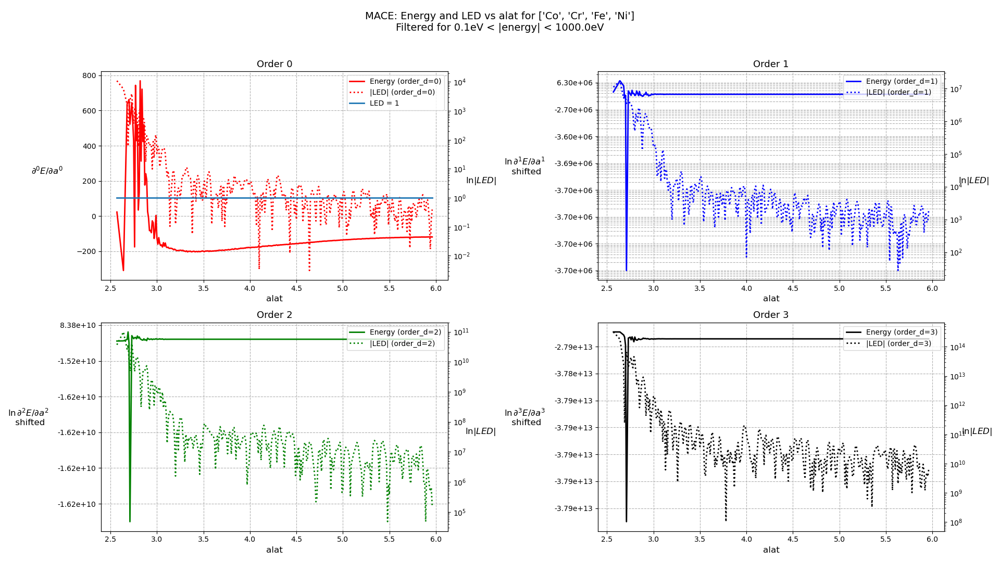
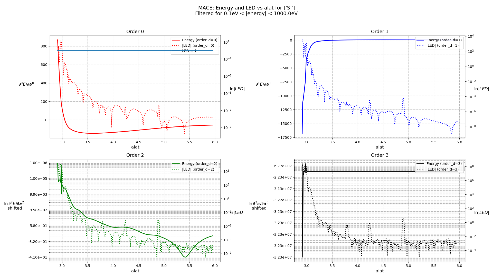
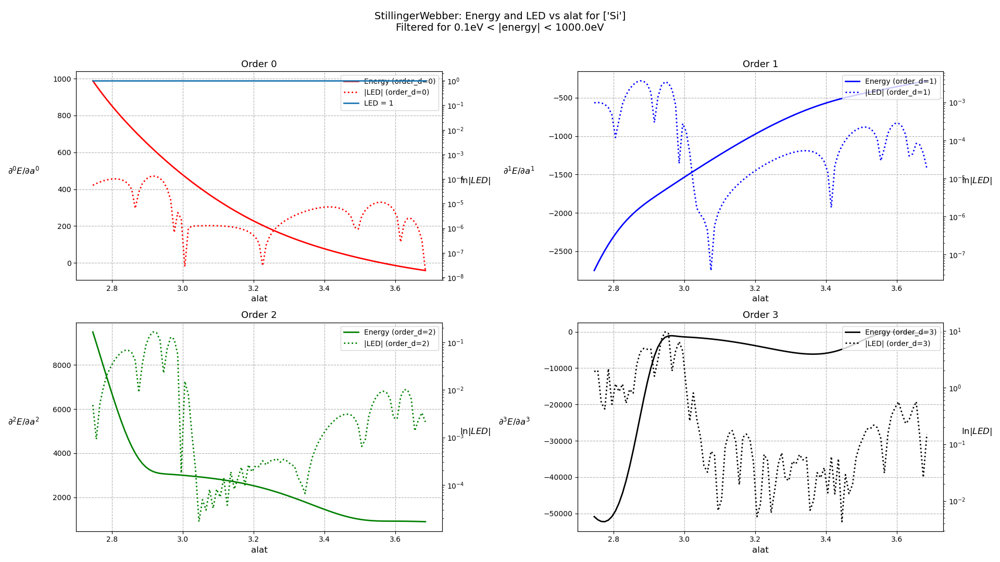
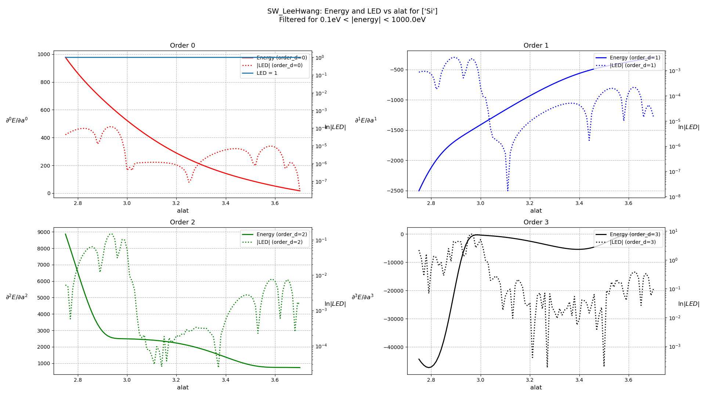

# "Good" Lattice Constant Range-Finder

### The plots below show 
* First 3 derivatives of Energy vs alat
* First 3 orders of Local Energy Difference vs alat

#### TO DO
* Must also include plots of Derivative Test for these models+species 
* The Good-Alat-Range is supposed to help us find the good alat
* The Derivative-Test can be used to verify that we've found a good alat

<h3> AlCoCrFeNi, MACE </h3>

<h3> Al, EAMCubinNaturalSpline </h3>

<h3> CdTe, SW_WangStroudMarkworth </h3>

<h3> CoCrFeNi, MACE </h3>

<h3> HCNOS, ALLEGRO </h3>

<h3> NiCoFeCrMn, MACE </h3>

<h3> Si, MACE </h3>

<h3> Si, StillingerWebber </h3>

<h3> Si, SW_LeeHwang </h3>

