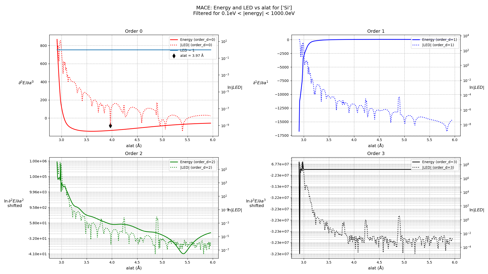
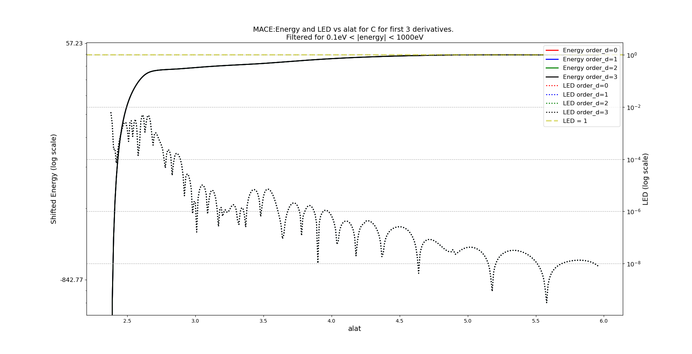
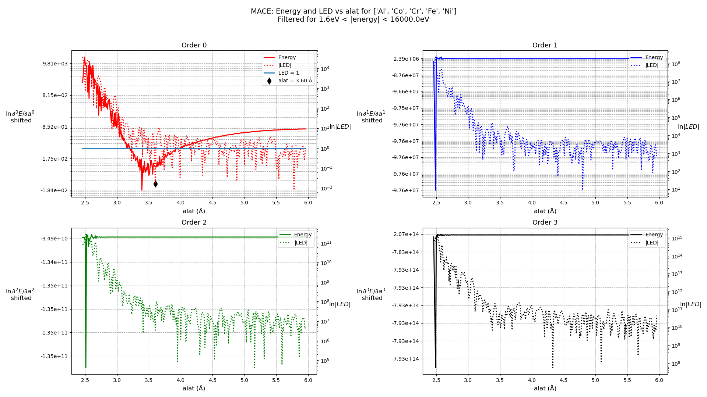
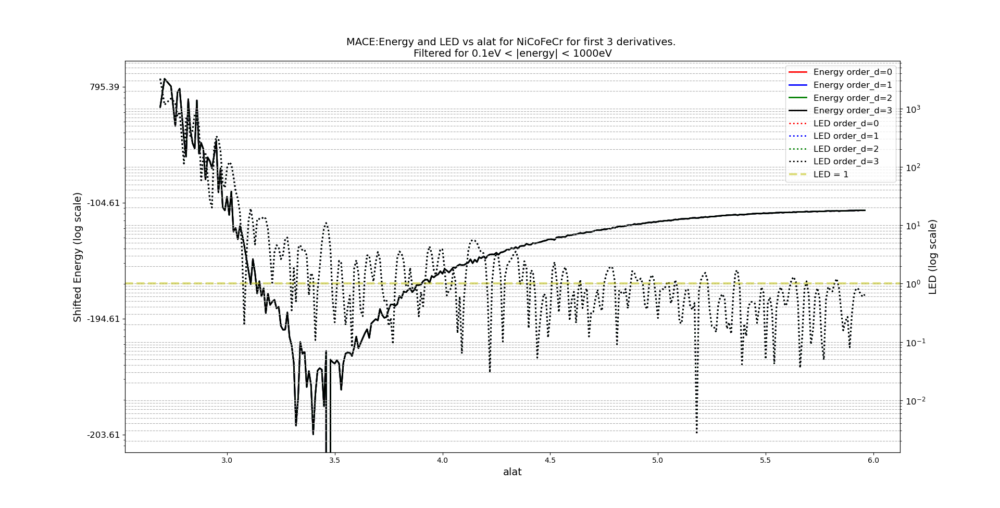
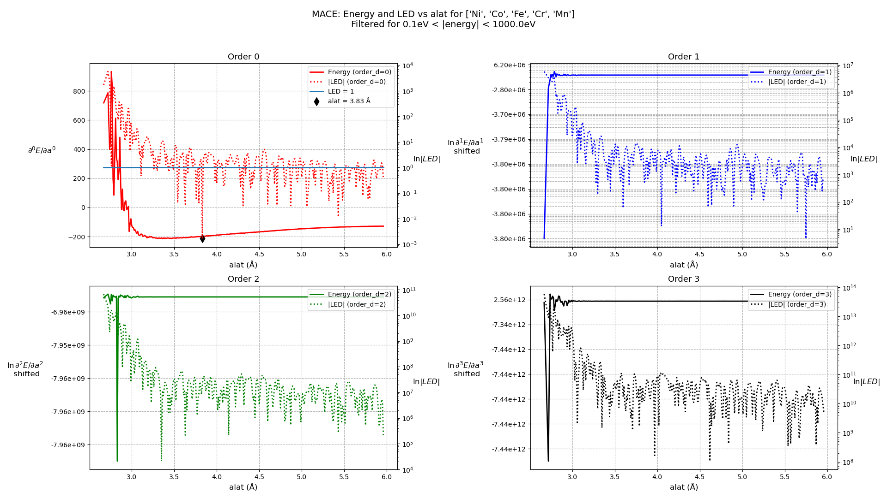
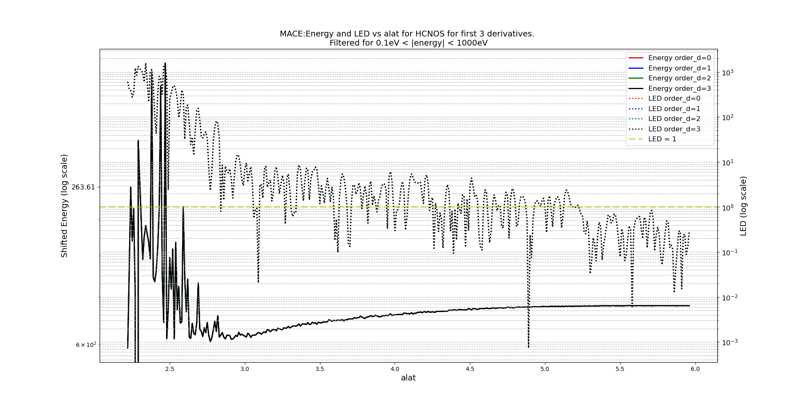
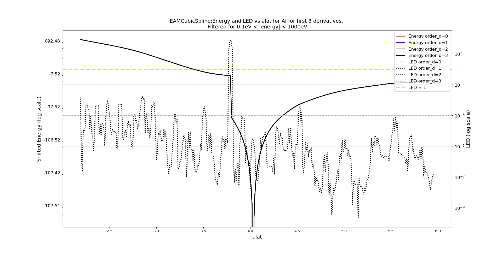
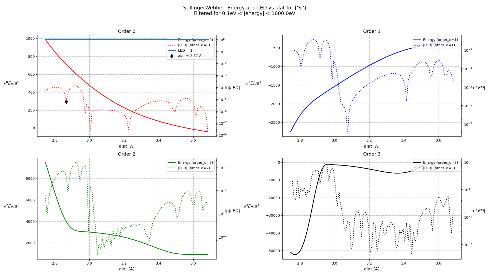
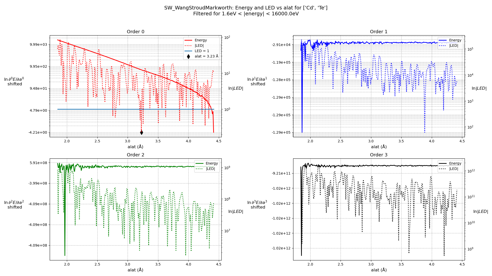
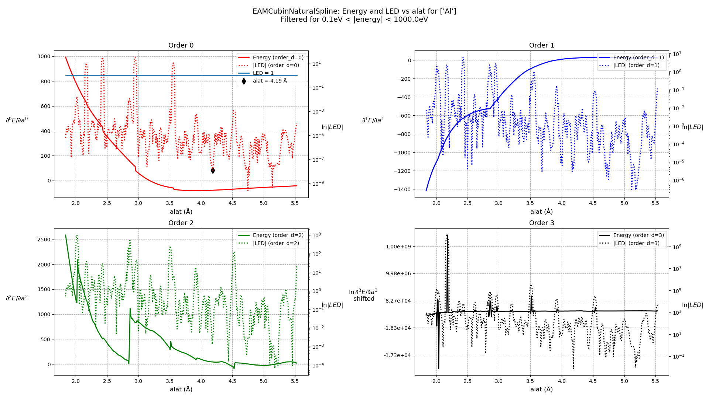

# "Good" Lattice Constant Range-Finder

<h3> Silicon, MACE <h3>
  

<h3> Carbon, MACE <h3>
 

<h3> AlCoCrFeNi HEA, MACE <h3>
 

<h3> NiCoFeCr, MACE <h3>
 

<h3> NiCoFeCrMn, MACE <h3>
 

<h3> HCNOS, MACE <h3>
 

<h3> Aluminium, MACE <h3>
 

<h3> Silicon, StillingerWebber <h3>
 

<h3> Silicon, SW_LeeHwang <h3>
 

<h3> CdTe, SW_WangStroudMarkworth <h3>
 

<h3> Aluminium, EAMCubinNaturalSpline <h3>
 

